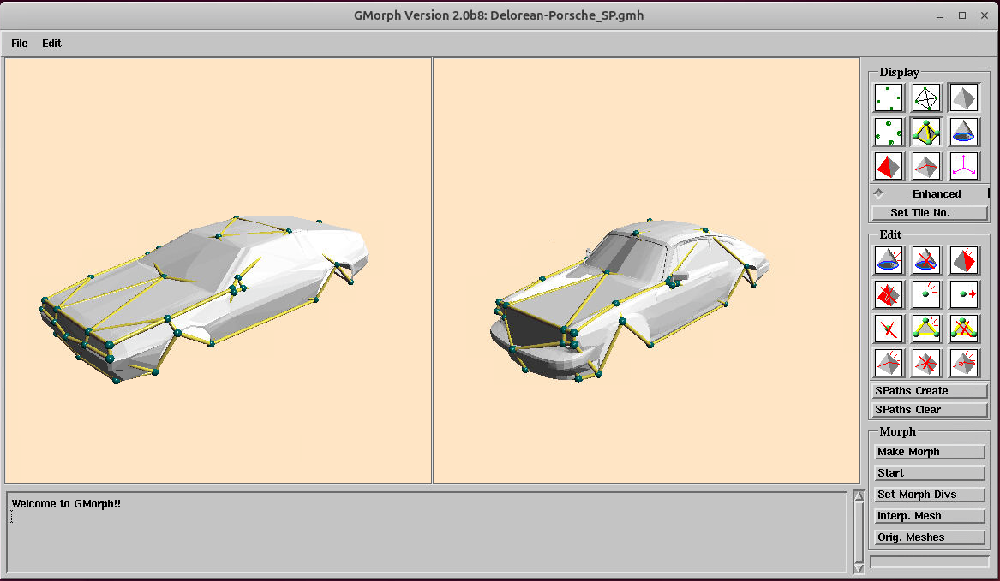

# gmorph2

**gmorph2** is a research code for 3D morphing between two meshes with arbitrary connectivities.
This code implements the following paper:

Takashi Kanai, Hiromasa Suzuki, Fumihiko Kimura:
“Metamorphosis of Arbitrary Triangular Meshes,”
IEEE Computer Graphics and Applications, Vol. 20, No. 2, pp. 62–75, March/April 2000.

This code is provided **for research purposes only and without any support**.
Originally, it was developed as code that runs on SGI workstations around 1997-1998.
This code was created earlier than the [Windows version](https://github.com/kanait/gmorph); the Windows version was later developed based on this code.
Recently, I updated the code to compile and run on Ubuntu 24.04, and fixed a few minor bugs that had been present since then.

## Compilation

To compile the code, you need to install the following libraries (via `apt`):

- libmotif-dev
- libgl1-mesa-dev
- libglu1-mesa-dev
- libglw1-mesa-dev
- libxpm-dev
You may also need additional libraries required by the packages above (for example: `libx11-dev`, `libxext-dev`, `libxt-dev`, `libxi-dev`, `libsm-dev`, `libice-dev`).

To create the executable file **gmorph2b8**, use CMake:

```bash
mkdir build
cd build
cmake ..
make
```

## Usage

The `gmorph2b8` executable supports both command-line and GUI use.
Morphing PPD generation has been verified for the following GMH files under `data.v2.0`.
(Figure numbers are those in the paper cited above.)

- bunny-tiger/bunny-tiger#1_SP001.gmh (Bunny's head - Tiger's head, rough corres., Figure 12(a))
- bunny-tiger/bunny-tiger_SP001.gmh (Bunny's head - Tiger's head, fine corres., Figure 12(b))
- Delorean-Porsche/Delorean-Porsche_SP.gmh (Delorean - Porsche, Figure 13)
- star-pai/spf1_6nSP0002.gmh (Star - Pai, Figure 14)
- torus-bottle/torus-bottle_SP008.gmh (Torus - Bottle, Figure 15)

To generate a morphing PPD from the command line, go to the folder that contains the GMH file and run:

```bash
../../build/gmorph2b8 in.gmh out.ppd
```

Basic CLI syntax:
`gmorph2b8 [options] <in.gmh> <out.ppd>`

This will generate the PPD file.
To start the GUI, use the following command. Note that the GUI requires an X11/GLX environment (an active X server).

```bash
../../build/gmorph2b8 -gui
```

This will start the GUI.

<p align="center">
  
</p>

### Command-line options (selected)
* `-div <n>`: morphing division number (default: 100; also affects the animation smoothness in GUI mode).
* `-smooth`: enable smooth shading.
* `-enh_disp`: enable enhanced display mode.
* `-rec <name>`: record morphing PPDs to files like `<name>_1.ppd`, `<name>_2.ppd`, ...
* `-mphtosgi`: save morphing results to SGI image files.
* `-spath <sublength> <out.gmh>`: make shortest-path mode graph (CLI-only).

## Authors

* **[Takashi Kanai](https://graphics.c.u-tokyo.ac.jp/hp/en/)** - The University of Tokyo

## License

This software is licensed under the MIT License - see the [LICENSE](LICENSE) file for details. 
